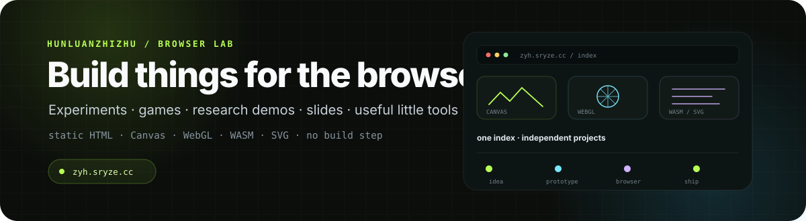

 

  

**个人 Browser Lab：浏览器实验、游戏、研究展示、讲稿和一些有用的小工具。**

---

## About

这个仓库是我的个人静态网站与浏览器实验集合。

**Live:** https://zyh.sryze.cc/

它不是一个统一框架，也没有构建系统。根目录的 `index.html` 负责项目索引与交互展示，每个子项目放在 `projects/<slug>/` 中，可以拥有完全独立的 HTML、CSS、JavaScript、WASM、WebGL 或其他前端实现。

核心原则很简单：

**one index · independent projects · browser first**

<table>
<tr>
<td width="33%" valign="top">

### 🧪 Browser experiments
Canvas、WebGL、SVG、WASM、交互图形和一些不太适合塞进传统作品集的实验。

</td>
<td width="33%" valign="top">

### 🧠 Research & demos
研究展示、AI 评测、组会讲稿、模型与算法相关的小型可视化项目。

</td>
<td width="33%" valign="top">

### 🧰 Small tools
尽量本地运行、无需后端或复杂部署的实用页面与工具。

</td>
</tr>
</table>

---

## Featured projects

| # | Project | What it is | Stack |
|---:|---|---|---|
| 01 | [Minecraft Web](https://zyh.sryze.cc/projects/minecraft-web/) | Rust + Bevy 编译到浏览器的 3D 沙盒实验 | Rust · Bevy · WASM |
| 02 | [Neon Pulse](https://zyh.sryze.cc/projects/neon-pulse/) | Canvas 霓虹街机 / 闪避游戏 | Canvas · Arcade |
| 03 | [Group Meeting PPTs](https://zyh.sryze.cc/projects/group-meeting-ppts/) | 组会讲稿聚合页与浏览器演示 | Slides · KaTeX · SVG · WebGL |
| 04 | [GUON Optimizer](https://zyh.sryze.cc/projects/guon-paper/) | 优化器 / LLM 方向的实验性研究展示 | LLM · Optimizer · Satire |
| 05 | [ECG AI Local](https://zyh.sryze.cc/projects/ecg-ai-local/) | 浏览器本地 ECG AI 实验 | TensorFlow.js · SNN · Local AI |
| 06 | [Liang Intensity Calibrator](https://zyh.sryze.cc/projects/liang-intensity-calibrator/) | 视频 / 图像驱动的连续强度校准器 | Video · Canvas · AI |
| 07 | [Game Studio Eval · Season 2](https://zyh.sryze.cc/projects/game-studio-eval-s2/) | AI 游戏生成能力的浏览器评测页 | Benchmark · Godot · WASM |
| 08 | [Dynamic SVG Pelican](https://zyh.sryze.cc/projects/svg-pelican/) | 动态 SVG / SMIL 绘制实验 | SVG · SMIL |
| 09 | [Blender 3D](https://zyh.sryze.cc/projects/blender-3d/) | Blender → glTF → WebGL 的 3D 展示实验 | Blender · glTF · WebGL |
| 10 | [Open Design Test](https://zyh.sryze.cc/projects/open-design-test/) | WebGL2 Shader 与开放式视觉设计实验 | WebGL2 · Shader |

### Client / commissioned work

| Project | Path | Stack |
|---|---|---|
| [Breakout](https://zyh.sryze.cc/projects/clients/breakout/) | `/projects/clients/breakout/` | Godot · SVG · WASM |
| [Fund Manager](https://zyh.sryze.cc/projects/fund-manager/) | `/projects/fund-manager/` | IndexedDB · SheetJS · Single-page |

部分历史或辅助页面仍保留在 `projects/` 下，但不会全部出现在首页索引中。例如第一届 Game Studio Eval 与早期 ECG 页面仍可独立访问。

---

## Homepage design

根首页是一个**单文件 HTML 应用**：

~~~text
index.html
├── inline fonts
├── inline CSS
├── inline JavaScript
├── project registry
├── Canvas 2D hero
├── project-card renderers
├── WebGL star field
├── search / filters
└── bilingual UI
~~~

运行时不依赖前端框架、包管理器或构建产物注入。

首页目前包含：

- **Browser Lab Hero** — Canvas 2D 实时三叶结线框主视觉；
- **项目索引** — 桌面 3 列、平板 2 列、手机 1 列；
- **搜索** — 支持按钮、`/`、`Ctrl K` / `Cmd K`；
- **分类过滤** — URL 中保存 `?category=`；
- **搜索状态** — URL 中保存 `?q=`；
- **ZH / EN** — 语言状态写入 `localStorage`；
- **Motion toggle** — 可手动暂停全站动效；
- **WebGL 星空** — 不可用时退化为静态 2D 背景；
- **Spider interaction** — 页面层面的一个小型交互实验；
- **原生滚动** — 不做 scroll hijacking（滚动劫持）。

---

## Visual system

首页的大部分视觉不是截图，而是运行时绘制：

~~~text
Canvas 2D
  ├── hero wireframe
  ├── voxel lattice
  ├── arcade corridor
  ├── slide fan
  ├── optimizer landscape
  ├── ECG strip
  └── project-specific diagrams

WebGL
  └── background star field

SVG / CSS
  └── interface details and project assets
~~~

项目卡片的图形会根据 hover、focus、touch 和可见性调整动画频率。

站点使用 **Bricolage Grotesque** 作为展示字体、**Cascadia Mono** 作为元信息字体；字体子集直接内联到首页，因此运行时无需额外字体请求。

---

## Repository structure

~~~text
hunluanzhizhu.github.io/
├── index.html
├── 404.html
├── CNAME
├── LICENSE
│
├── projects/
│   ├── minecraft-web/
│   ├── neon-pulse/
│   ├── group-meeting-ppts/
│   ├── guon-paper/
│   ├── ecg-ai-local/
│   ├── liang-intensity-calibrator/
│   ├── game-studio-eval-s2/
│   ├── svg-pelican/
│   ├── blender-3d/
│   ├── open-design-test/
│   └── ...
│
├── tools/
│   ├── subset-font.py
│   └── make-images.py
│
├── og.png
├── favicon.svg
├── favicon.ico
├── apple-touch-icon.png
├── robots.txt
├── sitemap.xml
└── site.webmanifest
~~~

---

## Local preview

普通页面可以直接使用 Python 静态服务器：

~~~bash
python -m http.server 8000
~~~

然后访问：

~~~text
http://localhost:8000/
~~~

### Video / Range requests

`liang-intensity-calibrator` 依赖视频逐帧 seek，需要 HTTP Range 请求支持。

调试该项目时建议使用仓库内的服务器：

~~~bash
python serve8000.py 8000
~~~

---

## Adding a project

新增项目通常只需要四步：

1. 在 `projects/` 下创建新的项目目录；
2. 放入独立的 `index.html` 与资源；
3. 在根 `index.html` 的项目注册数据中加入条目；
4. 同步更新 `sitemap.xml`。

示例注册项：

~~~js
{
  id: '11',
  slug: 'my-thing',
  title: 'MY THING',
  tag: 'DEMO',
  kind: 'app',
  stack: ['canvas'],
  fig: 'voxel',
  labelZh: '体素晶格',
  labelEn: 'VOXEL LATTICE',
  descZh: '一句话描述。',
  descEn: 'One line.'
}
~~~

`fig` 可以复用已有绘制器，也可以在首页的图形注册表中增加新的 renderer。

无需 npm install、bundle 或 CI 构建；提交静态文件即可部署。

---

## Generated assets

仓库里少量位图是本地生成的站点资产，而不是运行时依赖：

- `og.png` — 社交分享预览；
- `apple-touch-icon.png` — Apple touch icon。

重新生成：

~~~bash
python tools/make-images.py
~~~

字体子集：

~~~bash
python tools/subset-font.py --inject index.html 404.html
python tools/subset-font.py --report
~~~

这些工具都只在本地手动运行，不参与线上部署。

---

<strong>Implementation notes</strong>

### Animation budget

页面使用一个共享 `requestAnimationFrame` 循环：

- Hero 最高约 30 fps；
- 正在交互的项目图形最高约 60 fps；
- 视口内闲置图形降低刷新频率；
- 视口外停止绘制；
- 页面隐藏或用户暂停动效时停止循环。

### Group Meeting PPTs

`/projects/group-meeting-ppts/` 是聚合页，连接两场独立讲稿：

- `group-meeting-eml/` — 32 页；
- `group-meeting-ct/` — 43 页。

对应源码另见 [HunLuanZhiZhu/zuhui-ppt](https://github.com/HunLuanZhiZhu/zuhui-ppt)。

### Legacy project paths

- `/projects/game-studio-eval/` 保留第一届评测；
- `/projects/ecg-ai-local1/` 为早期页面；
- 它们存在于部署目录，但不作为当前首页主要卡片。

### Large assets

`projects/minecraft-web/minecraft_web_bg.wasm` 是较大的 WASM 资源。当前直接保存在仓库中；未来若继续增加大型二进制资产，可以考虑 Git LFS 或 GitHub Releases。

---

## Deployment

这是一个 GitHub Pages 静态站点。

自定义域名：

**https://zyh.sryze.cc/**

`CNAME`、`robots.txt`、`sitemap.xml`、Open Graph 元数据与 Web App Manifest 都直接保存在仓库中。

---

## License

MIT — see [LICENSE](./LICENSE).

